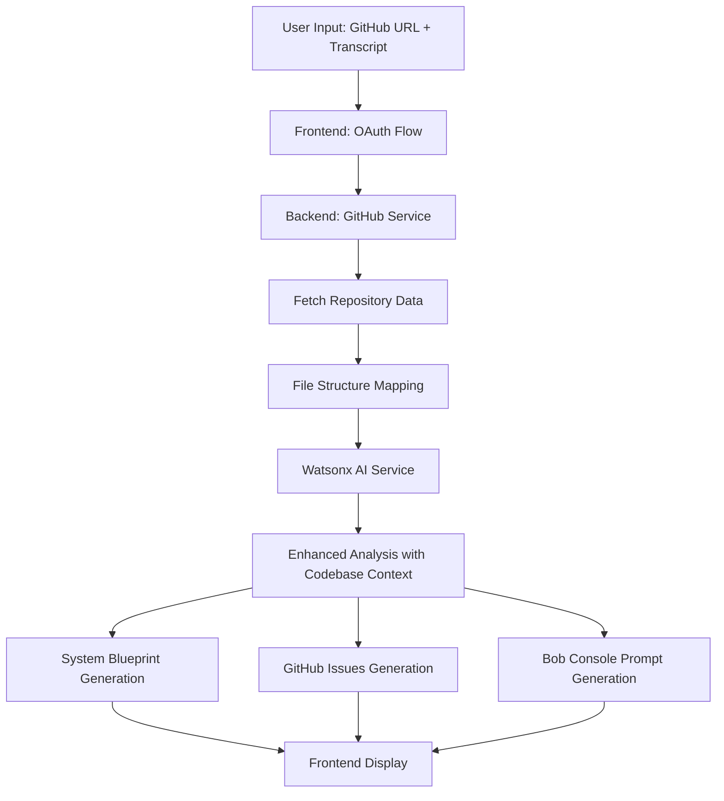

# GitHub Integration Implementation Plan

**Project:** NATS (Notes-to-Action Task Synthesizer) Architecture & Feature Planner
**Feature:** GitHub Repository Integration with AI-Powered Analysis
**Date:** 2026-05-16  
**Status:** Planning Phase

---

## Executive Summary

This plan outlines the implementation of GitHub repository integration that will:
1. Connect to GitHub repositories via OAuth
2. Fetch and map repository file structure
3. Enhance AI analysis with codebase context
4. Generate GitHub-aware System Blueprints
5. Create actionable GitHub Issues
6. Produce NATS Console prompts for implementation

---

## Architecture Overview



---

## Technical Specifications

### 1. GitHub OAuth Flow

**Scope:** `public_repo` (read-only access to public repositories)

**Flow:**
1. User clicks "Connect to GitHub"
2. Redirect to GitHub OAuth authorization
3. GitHub redirects back with authorization code
4. Backend exchanges code for access token
5. Store token securely (encrypted in session/database)
6. Fetch user's accessible repositories

**Security:**
- Use PKCE (Proof Key for Code Exchange) for enhanced security
- Store tokens encrypted at rest
- Implement token refresh mechanism
- Add rate limiting for API calls

### 2. Backend GitHub Service

**File:** `nats-backend/src/services/github.service.ts`

**Core Methods:**
```typescript
class GitHubService {
  // OAuth & Authentication
  async initiateOAuth(): Promise<{ authUrl: string }>
  async handleOAuthCallback(code: string): Promise<{ accessToken: string }>
  async validateToken(token: string): Promise<boolean>
  
  // Repository Operations
  async fetchRepository(owner: string, repo: string, token: string): Promise<Repository>
  async fetchBranches(owner: string, repo: string, token: string): Promise<Branch[]>
  async fetchFileTree(owner: string, repo: string, branch: string, token: string): Promise<FileNode[]>
  async fetchFileContent(owner: string, repo: string, path: string, token: string): Promise<FileContent>
  
  // Analysis Helpers
  async mapRepositoryStructure(fileTree: FileNode[]): Promise<RepositoryMap>
  async filterRelevantFiles(files: FileNode[]): Promise<FileNode[]>
  async validateFileSizes(files: FileNode[]): Promise<ValidationResult>
}
```

**File Size Limits:**
- Individual file: 500KB max
- Total analysis: 20MB max
- Skip binary files, images, and large assets

**File Filtering Strategy:**
```typescript
const RELEVANT_EXTENSIONS = [
  '.ts', '.tsx', '.js', '.jsx',
  '.py', '.java', '.go', '.rs',
  '.cpp', '.c', '.h', '.cs',
  '.rb', '.php', '.swift', '.kt',
  '.vue', '.svelte', '.astro',
  '.json', '.yaml', '.yml', '.toml',
  '.md', '.mdx'
];

const IGNORE_PATTERNS = [
  'node_modules/', 'dist/', 'build/',
  '.git/', '.next/', '.cache/',
  'coverage/', '__pycache__/',
  '*.min.js', '*.bundle.js'
];
```

### 3. Enhanced Type Definitions

**File:** `nats-backend/src/types/github.ts`

```typescript
export interface Repository {
  owner: string;
  name: string;
  fullName: string;
  description: string;
  defaultBranch: string;
  language: string;
  size: number;
  url: string;
}

export interface Branch {
  name: string;
  commit: {
    sha: string;
    url: string;
  };
  protected: boolean;
}

export interface FileNode {
  path: string;
  type: 'file' | 'dir';
  size: number;
  sha: string;
  url: string;
}

export interface FileContent {
  path: string;
  content: string;
  encoding: string;
  size: number;
  sha: string;
}

export interface RepositoryMap {
  structure: {
    directories: string[];
    files: FileNode[];
  };
  statistics: {
    totalFiles: number;
    totalSize: number;
    filesByExtension: Record<string, number>;
    primaryLanguage: string;
  };
  relevantFiles: FileNode[];
}
```

### 4. Enhanced System Blueprint

**Updated Type:** `nats-planner/src/types/index.ts`

```typescript
export interface TechnicalTask {
  id: string;
  title: string;
  description: string;
  riskLevel: RiskLevel;
  
  // GitHub-aware fields
  repository?: {
    owner: string;
    name: string;
    branch: string;
    url: string;
  };
  
  affectedFiles: AffectedFile[];
  implementationOrder: ImplementationStep[];
  estimatedEffort: string;
  
  // New metadata fields
  codebaseContext?: {
    primaryLanguage: string;
    framework: string;
    architecture: string;
    dependencies: string[];
  };
  
  relatedFiles?: {
    path: string;
    relevance: 'high' | 'medium' | 'low';
    reason: string;
  }[];
}
```

### 5. Watsonx AI Prompt Enhancement

**Updated Prompt Structure:**

```typescript
private createEnhancedSystemPrompt(repositoryMap?: RepositoryMap): string {
  const basePrompt = `You are an expert software engineering analyst...`;
  
  if (!repositoryMap) return basePrompt;
  
  return `${basePrompt}

CODEBASE CONTEXT:
Repository Structure:
${JSON.stringify(repositoryMap.structure, null, 2)}

File Statistics:
- Total Files: ${repositoryMap.statistics.totalFiles}
- Primary Language: ${repositoryMap.statistics.primaryLanguage}
- Files by Type: ${JSON.stringify(repositoryMap.statistics.filesByExtension)}

Relevant Files for Analysis:
${repositoryMap.relevantFiles.map(f => `- ${f.path} (${f.size} bytes)`).join('\n')}

INSTRUCTIONS:
1. Map the meeting transcript requirements to ACTUAL files in the repository
2. Use REAL file paths from the repository structure above
3. Identify which existing files need modification
4. Suggest new files that follow the project's structure patterns
5. Consider the project's architecture and dependencies
6. Ensure implementation order respects file dependencies

Your response must include:
- Accurate file paths matching the repository structure
- Clear distinction between existing files (modify) and new files (create)
- Implementation steps that reference actual codebase patterns
`;
}
```

### 6. GitHub Issues Generation

**Enhanced AI Instructions:**

```typescript
githubIssues: [
  {
    id: "issue-001",
    title: "string",
    tags: ["enhancement", "backend", "security"],
    description: "Detailed description referencing actual code locations",
    
    // Enhanced fields
    codeReferences: [
      {
        file: "src/auth/login.ts",
        lineRange: "45-67",
        snippet: "// relevant code snippet",
        reason: "This section handles authentication"
      }
    ],
    
    acceptanceCriteria: [
      {
        id: "ac-001-1",
        description: "Specific, testable criteria",
        completed: false,
        
        // New fields
        affectedFiles: ["src/auth/login.ts", "src/middleware/auth.ts"],
        testStrategy: "Unit tests + Integration tests"
      }
    ],
    
    priority: "high",
    estimatedEffort: "4 hours",
    dependencies: ["issue-002"],
    labels: ["security", "authentication"]
  }
]
```

### 7. NATS Console Prompt Format

**Structure (Following NATS Documentation):**

```markdown
# Task: [Title from System Blueprint]

## Context
[Repository information and current state]
- Repository: owner/repo-name
- Branch: main
- Primary Language: TypeScript
- Framework: React + Fastify

## Objective
[Clear, concise description of what needs to be accomplished]

## Codebase Analysis
### Current Architecture
[Description of relevant architecture patterns]

### Affected Components
[List of files and their current state]

## Implementation Requirements

### Step 1: [First Implementation Step]
**Files to Modify:**
- `src/path/to/file.ts` - [Description of changes]

**Changes Required:**
- [Specific change 1]
- [Specific change 2]

**Code References:**
```typescript
// Current implementation (lines 45-50)
[relevant code snippet]
```

### Step 2: [Second Implementation Step]
[Similar structure...]

## Acceptance Criteria
- [ ] Criterion 1 with specific file references
- [ ] Criterion 2 with testable outcomes
- [ ] Criterion 3 with performance metrics

## Testing Strategy
- Unit tests for: [specific functions]
- Integration tests for: [specific flows]
- Manual testing: [specific scenarios]

## Dependencies & Constraints
- Must maintain backward compatibility with [component]
- Requires [dependency] version X.Y.Z
- Performance target: [specific metric]

## Risk Assessment
**Risk Level:** [Low/Medium/High]
**Mitigation Strategies:**
- [Strategy 1]
- [Strategy 2]

## Additional Notes
[Any other relevant information, edge cases, or considerations]
```

---

## Implementation Phases

### Phase 1: Backend GitHub Service (Days 1-2)

**Tasks:**
1. Create `github.service.ts` with OAuth implementation
2. Implement repository fetching and branch listing
3. Add file tree traversal and content fetching
4. Implement file filtering and size validation
5. Create repository mapping logic
6. Add comprehensive error handling
7. Write unit tests for GitHub service

**Files to Create/Modify:**
- `nats-backend/src/services/github.service.ts` (create)
- `nats-backend/src/types/github.ts` (create)
- `nats-backend/src/config/env.ts` (modify - add GitHub OAuth config)
- `nats-backend/.env.example` (modify - add GitHub credentials)

### Phase 2: Backend API Routes (Day 2)

**Tasks:**
1. Create GitHub OAuth endpoints
2. Add repository listing endpoint
3. Add branch fetching endpoint
4. Add file structure endpoint
5. Update analyze endpoint to accept GitHub context
6. Add rate limiting middleware

**Files to Create/Modify:**
- `nats-backend/src/routes/github.routes.ts` (create)
- `nats-backend/src/routes/planner.routes.ts` (modify)
- `nats-backend/src/index.ts` (modify - register new routes)

### Phase 3: Enhanced AI Integration (Days 3-4)

**Tasks:**
1. Update Watsonx service to accept repository context
2. Enhance system prompt with codebase information
3. Update response schema for GitHub-aware outputs
4. Implement NATS Console prompt generation
5. Add validation for AI responses with GitHub context

**Files to Modify:**
- `nats-backend/src/services/watsonx.service.ts`
- `nats-backend/src/types/intent.ts`

### Phase 4: Frontend OAuth Flow (Day 4)

**Tasks:**
1. Create OAuth initiation component
2. Handle OAuth callback and token storage
3. Add repository selection UI
4. Add branch selection UI
5. Show repository connection status
6. Add disconnect/reconnect functionality

**Files to Create/Modify:**
- `nats-planner/src/components/GitHubConnect.tsx` (create)
- `nats-planner/src/components/LeftPanel.tsx` (modify)
- `nats-planner/src/context/ProjectPlannerContext.tsx` (modify)

### Phase 5: Enhanced UI Components (Days 5-6)

**Tasks:**
1. Update System Blueprint to show GitHub metadata
2. Enhance GitHub Issues with code references
3. Create Bob Console prompt display component
4. Add file tree visualization
5. Add loading states for GitHub operations
6. Implement error handling UI

**Files to Create/Modify:**
- `nats-planner/src/components/SystemBlueprint.tsx` (modify)
- `nats-planner/src/components/GithubIssuesView.tsx` (modify)
- `nats-planner/src/components/BobConsole.tsx` (modify)
- `nats-planner/src/components/FileTreeView.tsx` (create)
- `nats-planner/src/types/index.ts` (modify)

### Phase 6: Integration & Testing (Day 7)

**Tasks:**
1. End-to-end testing with real repositories
2. Performance optimization for large repos
3. Error handling validation
4. Security audit of OAuth flow
5. Documentation updates
6. User acceptance testing

---

## API Endpoints

### GitHub OAuth

```
POST /api/v1/github/oauth/initiate
Response: { authUrl: string, state: string }

POST /api/v1/github/oauth/callback
Body: { code: string, state: string }
Response: { accessToken: string, user: GitHubUser }

POST /api/v1/github/oauth/validate
Headers: { Authorization: Bearer <token> }
Response: { valid: boolean, user: GitHubUser }
```

### Repository Operations

```
GET /api/v1/github/repositories
Headers: { Authorization: Bearer <token> }
Response: { repositories: Repository[] }

GET /api/v1/github/repository/:owner/:repo
Headers: { Authorization: Bearer <token> }
Response: { repository: Repository }

GET /api/v1/github/repository/:owner/:repo/branches
Headers: { Authorization: Bearer <token> }
Response: { branches: Branch[] }

GET /api/v1/github/repository/:owner/:repo/tree/:branch
Headers: { Authorization: Bearer <token> }
Query: { maxSize?: number, maxFiles?: number }
Response: { tree: FileNode[], map: RepositoryMap }
```

### Enhanced Analysis

```
POST /api/v1/planner/analyze-with-github
Headers: { Authorization: Bearer <token> }
Body: {
  transcript: string,
  repository: {
    owner: string,
    name: string,
    branch: string
  }
}
Response: {
  success: boolean,
  data: {
    technicalTask: TechnicalTask,
    githubIssues: GithubIssue[],
    bobPrompt: BobPrompt,
    repositoryContext: RepositoryMap
  }
}
```

---

## Environment Variables

**Backend (.env):**
```bash
# Existing variables...

# GitHub OAuth
GITHUB_CLIENT_ID=your_github_oauth_app_client_id
GITHUB_CLIENT_SECRET=your_github_oauth_app_client_secret
GITHUB_REDIRECT_URI=http://localhost:3000/api/v1/github/oauth/callback

# GitHub API
GITHUB_API_URL=https://api.github.com
GITHUB_MAX_FILE_SIZE=512000  # 500KB in bytes
GITHUB_MAX_TOTAL_SIZE=20971520  # 20MB in bytes
```

**Frontend (.env):**
```bash
# Existing variables...

# GitHub OAuth
VITE_GITHUB_CLIENT_ID=your_github_oauth_app_client_id
VITE_GITHUB_REDIRECT_URI=http://localhost:5173/github/callback
```

---

## Security Considerations

1. **Token Storage:**
   - Never store tokens in localStorage (XSS vulnerability)
   - Use httpOnly cookies or secure session storage
   - Implement token encryption at rest

2. **Rate Limiting:**
   - GitHub API: 5,000 requests/hour for authenticated users
   - Implement client-side caching
   - Add backend rate limiting middleware

3. **Input Validation:**
   - Validate repository URLs
   - Sanitize file paths
   - Validate file sizes before fetching

4. **Error Handling:**
   - Never expose GitHub tokens in error messages
   - Log security events
   - Implement proper error boundaries

---

## Testing Strategy

### Unit Tests
- GitHub service methods
- File filtering logic
- Size validation
- Repository mapping

### Integration Tests
- OAuth flow end-to-end
- Repository fetching with real GitHub API
- AI analysis with GitHub context
- Complete workflow: Connect → Fetch → Analyze → Generate

### Performance Tests
- Large repository handling (1000+ files)
- Concurrent user requests
- API rate limit handling
- Memory usage with large file trees

---

## Success Metrics

1. **Functionality:**
   - ✅ OAuth flow completes successfully
   - ✅ Repository files fetched within 5 seconds
   - ✅ AI generates accurate file mappings (>90% accuracy)
   - ✅ System Blueprint includes real file paths
   - ✅ GitHub Issues reference actual code locations
   - ✅ NATS Console prompt is actionable

2. **Performance:**
   - Repository connection: < 2 seconds
   - File tree fetch: < 5 seconds
   - AI analysis: < 10 seconds
   - Total workflow: < 20 seconds

3. **User Experience:**
   - Clear error messages
   - Loading states for all async operations
   - Ability to disconnect and reconnect
   - Visual feedback for GitHub connection status

---

## Rollback Plan

If issues arise during implementation:

1. **Phase 1-2 Issues:** Revert backend changes, use mock data
2. **Phase 3 Issues:** Disable GitHub context in AI prompts
3. **Phase 4-5 Issues:** Hide GitHub UI components, use manual input
4. **Critical Issues:** Feature flag to disable entire GitHub integration

---

## Future Enhancements

1. **Private Repository Support:** Upgrade OAuth scope
2. **Multi-Repository Analysis:** Compare across repositories
3. **Pull Request Integration:** Create PRs directly from blueprint
4. **Code Search:** Search within repository files
5. **Dependency Analysis:** Analyze package.json, requirements.txt
6. **Git History Analysis:** Consider recent commits in analysis

---

## Dependencies

**Backend:**
- `@octokit/rest` - GitHub API client
- `@octokit/auth-oauth-app` - OAuth authentication
- `simple-oauth2` - OAuth 2.0 flow handling

**Frontend:**
- No new dependencies (use existing fetch API)

---

## Documentation Updates Required

1. Update README with GitHub setup instructions
2. Add OAuth app creation guide
3. Document new API endpoints
4. Update user guide with GitHub features
5. Add troubleshooting section for GitHub issues

---

## Timeline Summary

- **Day 1-2:** Backend GitHub service + API routes
- **Day 3-4:** AI integration + Frontend OAuth
- **Day 5-6:** Enhanced UI components
- **Day 7:** Testing + Documentation

**Total Estimated Time:** 7 days

---

## Next Steps

1. Review and approve this plan
2. Set up GitHub OAuth application
3. Create feature branch: `feature/github-integration`
4. Begin Phase 1 implementation
5. Daily progress reviews

---

**Plan Status:** ✅ Ready for Review  
**Approval Required:** Yes  
**Implementation Start:** Pending Approval
